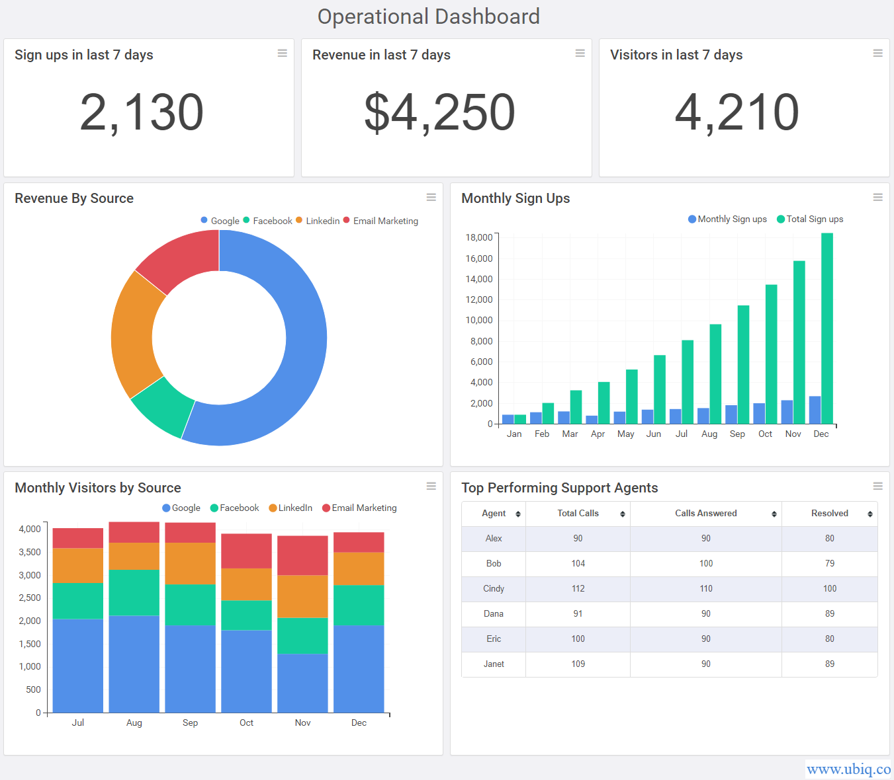
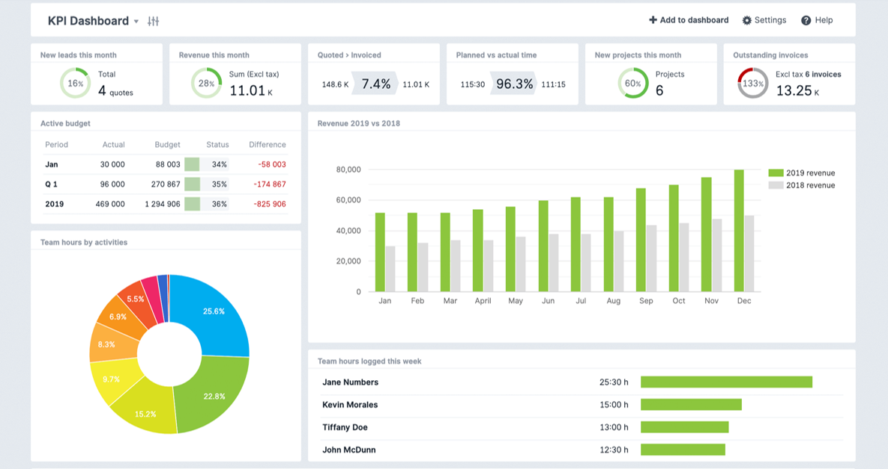
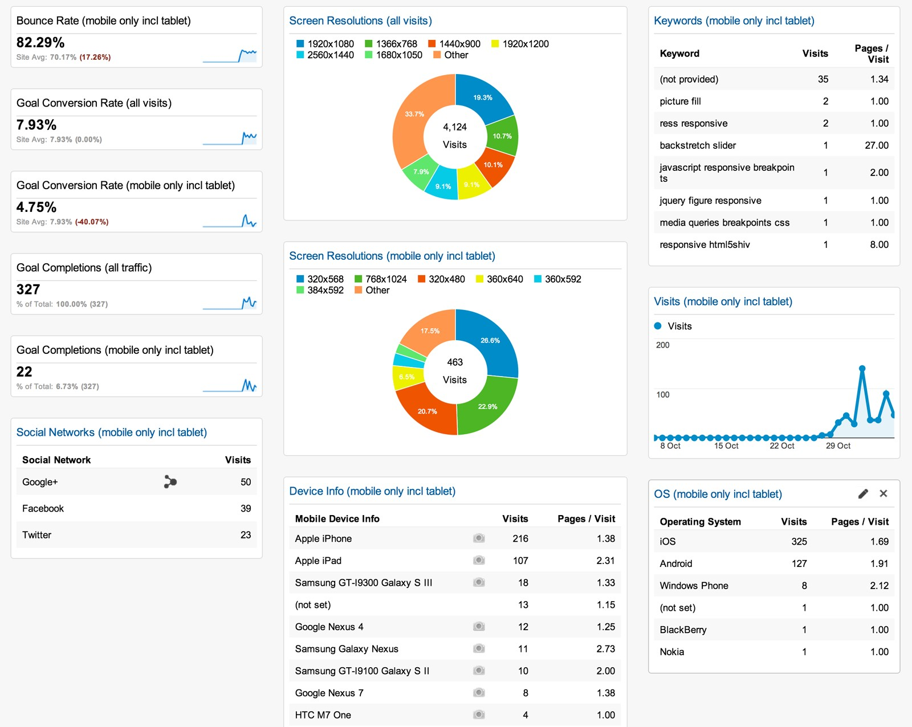

# Planning

## The requirements

Identify the business need. 

* Every report tells a story 

* Make sure that story matches the business need 

* Don’t include visuals that don’t match the business need. If you believe there is a visual that will provide substantial insight – discuss this with users/the customer to see if this provides useful insight and is relevant to their needs 

Identify the customer. 

* Design a report that uses familiar terminology and complexity on a par with the customer’s level of knowledge 

* Design separate report pages for different customer “types” – this may extend to creating separate reports for separate users, will all reports connected to the same dataset 

Choose appropriate visuals 

* Visualisations give insight into the data in the most effective way possible 

* Visuals such as charts and graphs make it easier to interpret the data  

* A report can have one or more pages of visuals and is based on one dataset 

* A dashboard is a single page containing the most important visuals, to give an at-a-glance view of the whole report 

Identify the data 

* Filter the amount shown in the visual with minimal impact to the end user  

* Remove tables or columns that are unused 

* Avoid distinct counts on fields with high cardinality (i.e., millions of values) 

* Avoid unnecessary precision - split date-time values into separate columns 

* Use integers instead of strings, where possible 

* Be wary of DAX functions that need to test every row in a table (e.g. RANKX is perhaps the worst culprit for this)

{width=75%}

## Select the right type of dashboard

There are three common types of dashboard, each performing a specific purpose.  

The types of dashboard are: 

1. operational dashboards 

2. strategic/executive dashboards 

3. analytical dashboards 

**Operational dashboards **

Operational dashboards often require real-time or near real-time data. They monitor the performance of your operation and can be useful for checking performance or network traffic, usage etc.  

{width=75%}

**Strategic/executive dashboards**

Strategic dashboards will typically provide the KPIs (Key Performance Indicators) that a company’s executive team track on a periodic (daily, weekly or monthly) basis, and should provide the executive team with a high-level overview of the state of the business together with the opportunities the business faces. 

{width=75%}

**Analytical dashboards**

This type of dashboard will offer drill-down functionality - allowing the user to explore more of the data and get different insights. Often dashboards include this functionality when it is not required.

{width=75%}

## Input data

Rather than importing the entire data set in Power BI, we should identify the typical information that our viewer wants to see and based on that, we can create database queries to retrieve only that part of data. 

Input data in the report should be exactly as supplied by the supplier. 

Modellers should not be making manual adjustments to supplied data and any amendments should be done by auditable formulas within the model, not prior to the data going into the model. 

Gauge an understanding of the data, as this will affect how you want to visualise it: 

* how was it collected - manual or automatic 

* data quality - is it accurate, concise and complete  

* type of data - funding, performance reviews etc 

* level of data - simplified overview or specific detail 

* amount of data - is it all required 

* hierarchy - ability to drill down or not 

Liaise carefully with those supplying the input to ensure a full appreciation of scope, definitions and quality, etc.  

As a minimum, record: 

* who supplied it and when 

* a link (if available, e.g. if it is published data) 

* its level of quality assurance 

* if/when it requires updating 

* If Official Statistics are being used/created liaise with the statistics team to ensure they are used correctly 

Ensure that the dashboard data is refreshed at appropriate intervals. This will save time during development and should ensure optimal performance once the dashboard is live. It is also worth considering whether importing your data or Direct Query is more appropriate. It may be that you import the data while you are developing the dashboard, and then work with a data modeller to add the extra data manipulation that you require to the underlying data cube once the dashboard design is finalised. This will then allow you to switch to Direct Query once the dashboard is running as a Business As Usual process. 
