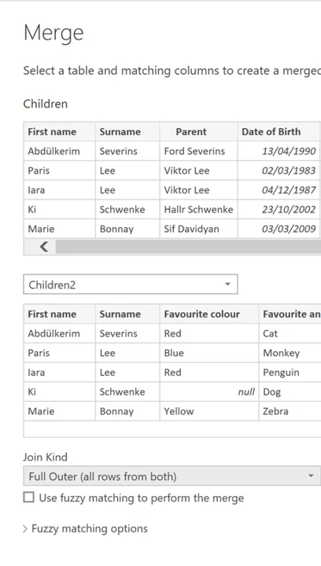
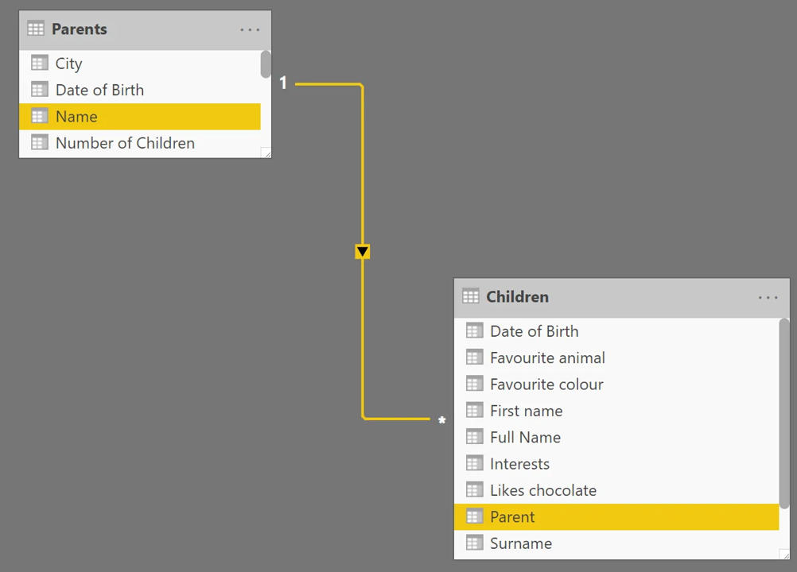

## Data modelling

Data Modelling is shaping the data to meet your needs, to enable you to create visual reports that you can share with others.  

:::: {.infoboxblue .info}

**Shaping** data means transforming the data – such as renaming columns or tables, changing text to numbers, removing rows, setting the first row as headers etc.  
::::

PowerBI allows you to transform data via the query editor. This can be transformations such as changing the type of data (PowerBI is usually good at recognising numbers, dates, percentages etc. but sometimes the data type may need to be updated), renaming columns and removing blank rows.

{width=75%}

:::: {.infoboxblue .info}

**Combining** data means connecting to two or more data sources, shaping them as needed, then consolidating them into one useful query. 

::::

Tables can be merged where there is overlapping data. For example, if there are two tables containing information about the same children, these can be merged into one table.

{width=40%}

If there is an additional table containing information about the parent of the child, then these two tables can be linked. This will allow for different filtering options, and allow for more interactivity between the two tables.

{width=75%}

Optimize the data-model by doing the following:  

* Shape and combine data 

* Group rows 

* Pivot columns 

* Use date tables where necessary 

* Create custom columns (e.g. calculated columns, measures & tables) 

* If it’s possible in the model, consider creating a measure only table 

* Set data types correctly 

* Use of query formulas 

* Use user-friendly formatting to the data 

* Use user-friendly naming conventions for fields, measures and tables 

* Validate relationships between tables are created correctly 

* Use the right visualization that communicates the story of the data as clearly as possible. 

* Remember the user and their experience with your solution!  

Extensive data modelling should not be performed in Power BI, as this will be slow and not provide a good user experience. If the data requires substantial manipulation, best practice would be to do the data modelling in a format such as SQL or Tabular first. The data model can then be imported to Power BI to build the dashboard. The balance between how much to do in Power BI vs other formats will vary from project to project, and the modeler must use their judgement to decide what is appropriate. 