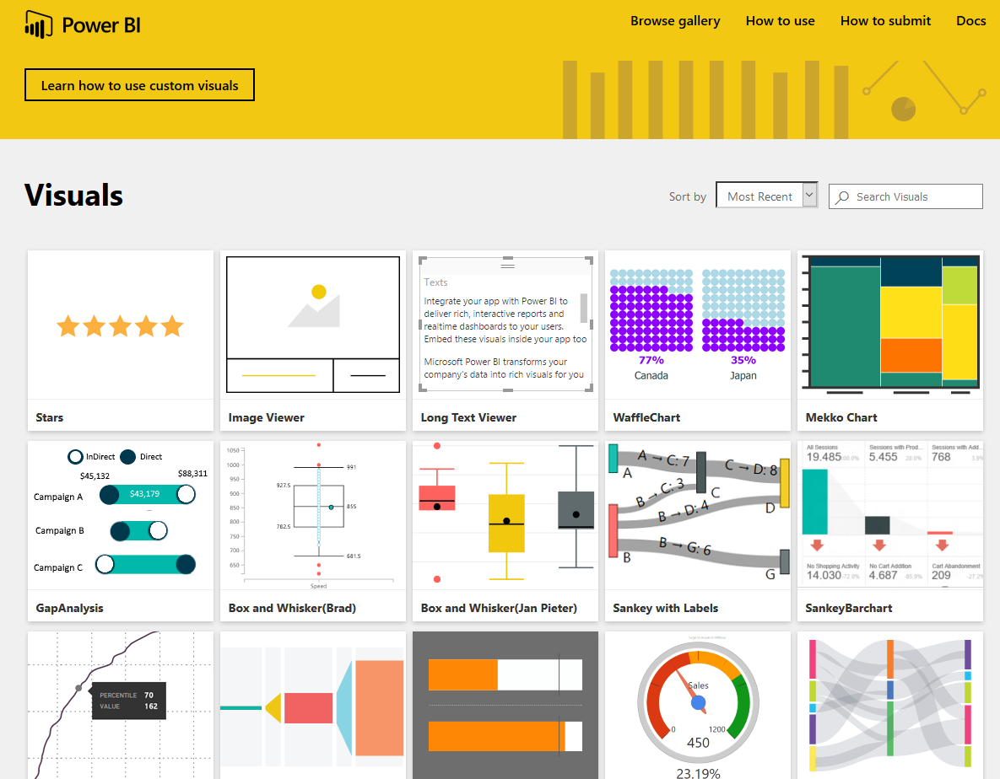

# Custom visuals

When creating or editing a Power BI report, there are many different types of visuals available for you to use. However, you are not limited to this set of visuals; selecting the ellipses opens up another source of report visuals. Custom visuals are created by developers, using the custom visuals software development kit, to enable business users to see their data in a way that fits the business best.  

Note: DfE is wary of using third party visuals. In general, try to stick to Microsoft approved custom visuals. 

## Types of custom visuals

Custom visuals can be in the form of three deployment channels: 

1. Custom visuals: 

Packages that include code for rendering into a single .pbiviz file, that can be imported into a Power BI report 

2. Organization visuals: 

Power BI admins can deploy custom visuals into their organization for report authors to use. It is an easy way to discover visuals that are unique to the organization, as well as a seamless support for updating those visuals 

3. Marketplace visuals 

Members of the community, as well as Microsoft, have contributed their custom visuals to the benefit of the public and published them to AppSource marketplace (see the links section)

