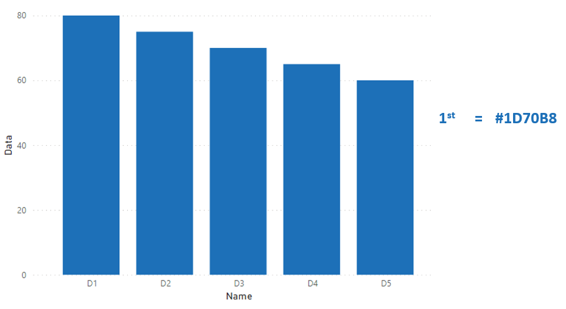
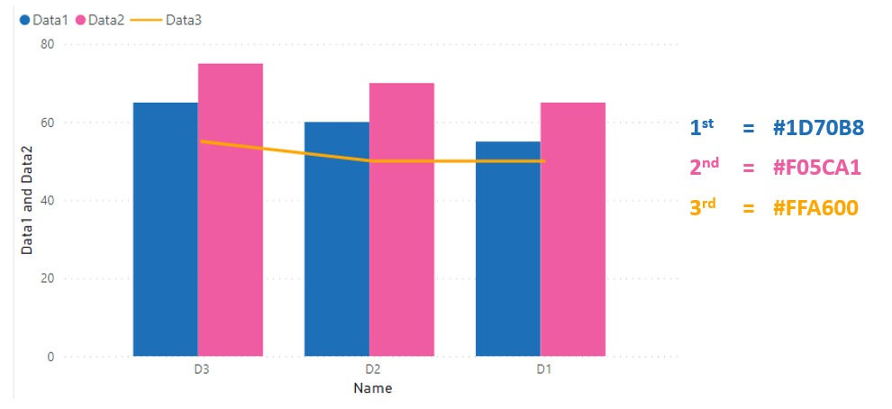

# Government colour standards

The following colour palette is recommended for standard data science visualisations and has been incorporated into the powerBI standard temple json.

## Bar Chart (colour palette)

{width=75%}

1st = #1D70B8, 2nd = #BC65BD, 3rd = #F05CA1, 4th = #FF6F61, 5th = #FFA600

## Bar Chart (single palette)

{width=75%}

1st = #1D70B8

## Bar Chart (tinted palette)

{width=75%}

1st = #1D70B8, 2nd = #3088C8, 3rd = #489FD6, 4th = #62B7E4, 5th = #7FCFF2

## Combi Chart (colour palette)

{width=75%}

1st = #1D70B8, 2nd = #F05CA1, 3rd = #FFA600

## Combi Chart (tinted palette)

{width=75%}

1st= #1D70B8, 2nd = #489FD6, 3rd = #FFA600

## Line Chart (colour palette)

{width=75%}

1st = #1D70B8, 2nd = #BC65BD, 3rd = #F05CA1, 4th = #FF6F61, 5th = #FFA600

## Line Chart (tinted palette)

{width=75%}

1st= #1D70B8, 2nd = #3088C8, 3rd = #489FD6, 4th = #62B7E4, 5th = #7FCFF2

## Additional resources: 

https://style.ons.gov.uk/category/data-visualisation/

https://design-system.service.gov.uk/styles/colour/
