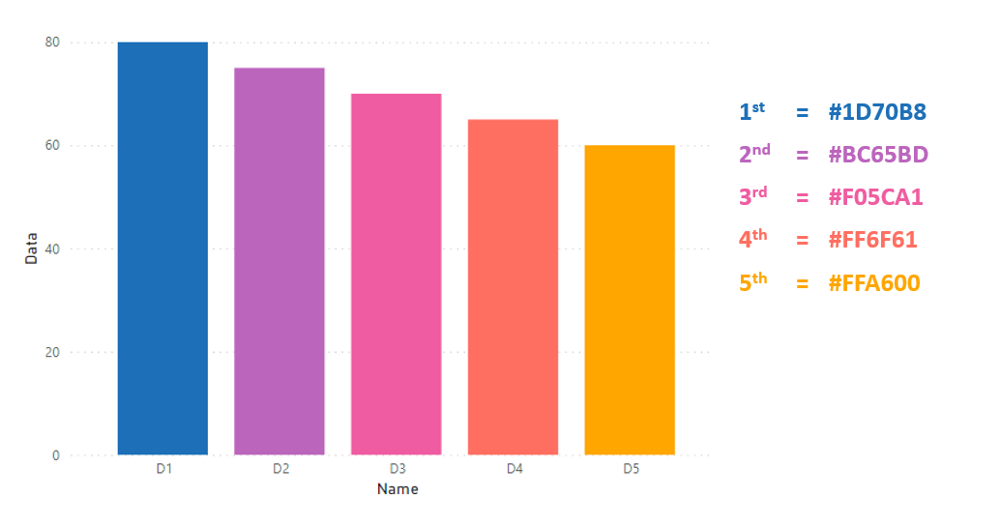
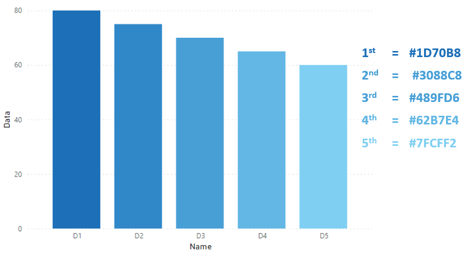
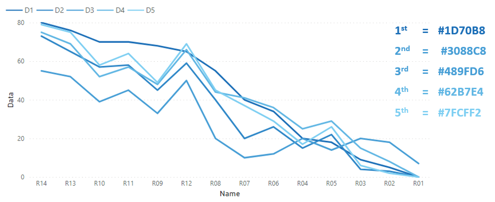

# Links

## What is Power BI desktop?

This is the link to everything you need to know about Power BI (and where you can download the Microsoft tutorial pdf) 

https://docs.microsoft.com/en-us/power-bi/desktop-what-is-desktop

## Government colour standards

The following colour palette is recommended for standard data science visualisations and has been incorporated into the powerBI standard temple json.

### Bar Chart (colour palette)

{width=50%}

1st = #1D70B8, 2nd = #BC65BD, 3rd = #FO5CA1, 4th = #FF6F61, 5th = #FFA600

### Bar Chart (single palette)

{width=50%}

1st = #1D70B8

### Bar Chart (tinted palette)

{width=50%}

1st = #1D70B8, 2nd = #3088C8, 3rd = #489FD6, 4th = #62B7E4, 5th = #7FCFF2

### Combi Chart (colour palette)

{width=50%}

1st = #1D70B8, 2nd = #FOSCA1, 3rd = #FFA600

### Combi Chart (tinted palette)

{width=50%}

1st= #1D70B8, 2nd = #489FD6, 3rd = #FFA600, 4th = #7FCFF2

### Line Chart (colour palette)

{width=50%}

1st = #1D70B8, 2nd = #BC65BD, 3rd = #F05CA1, 4th = #FF6F61, 5th = #FFA600

### Line Chart (tinted palette)

{width=50%}

1st= #1D70B8, 2nd = #3088C8, 3rd = #489FD6, 5th = #7FCFF2

### Additional resources: 

https://style.ons.gov.uk/category/data-visualisation/

https://design-system.service.gov.uk/styles/colour/

## Custom visuals and the AppSource marketplace

https://powerbi.microsoft.com/en-us/developers/custom-visualization/

https://appsource.microsoft.com/en-us/marketplace/apps?product=power-bi-visuals

## Useful links

Chart types: https://docs.microsoft.com/en-us/power-bi/visuals/power-bi-visualization-types-for-reports-and-q-and-a

Layouts: https://powerbi.tips/2018/01/introducing-layouts/

Themes: https://docs.microsoft.com/en-us/power-bi/desktop-report-themes

Gallery: https://community.powerbi.com/t5/Themes-Gallery/bd-p/ThemesGallery

DAX: https://msdn.microsoft.com/library/gg413422.aspx